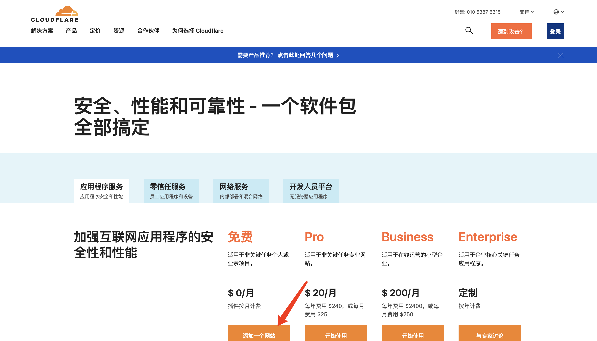
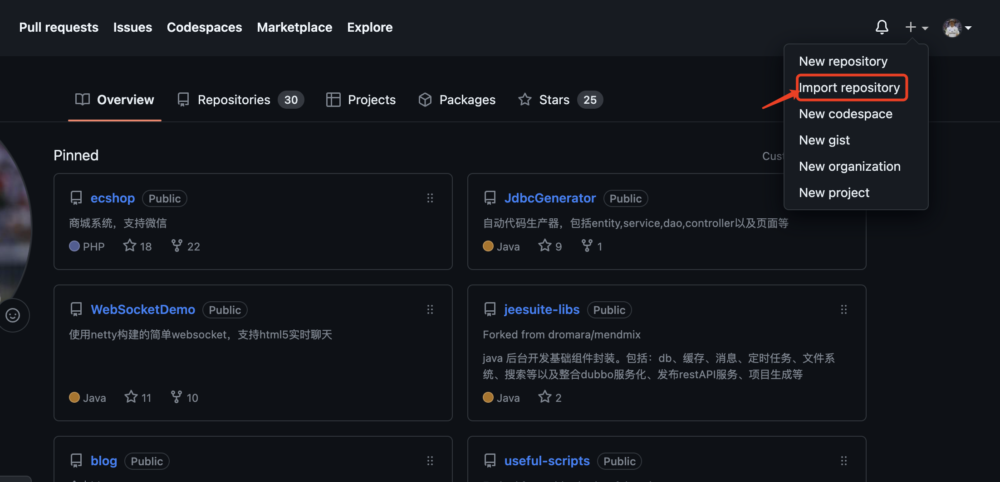
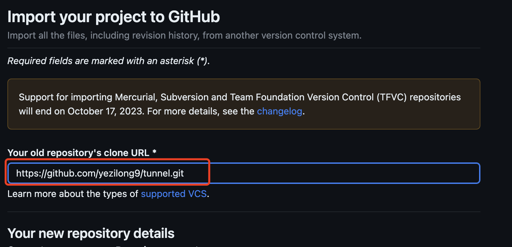
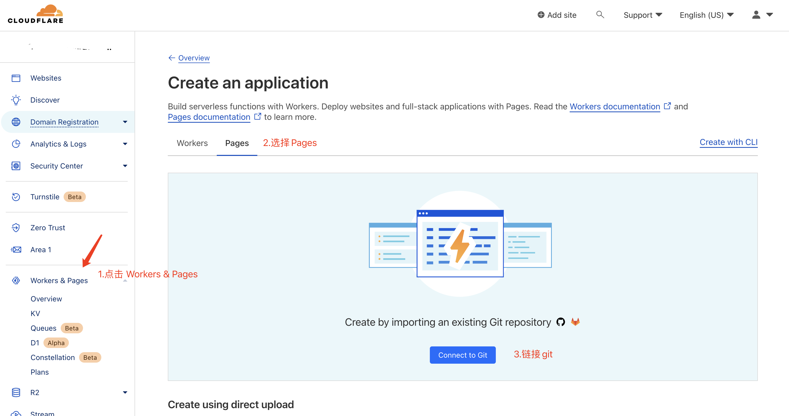
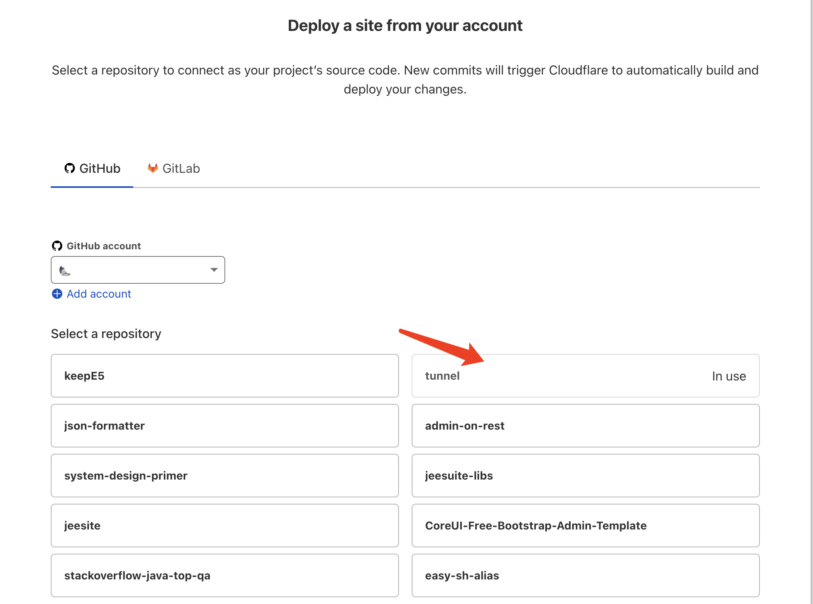
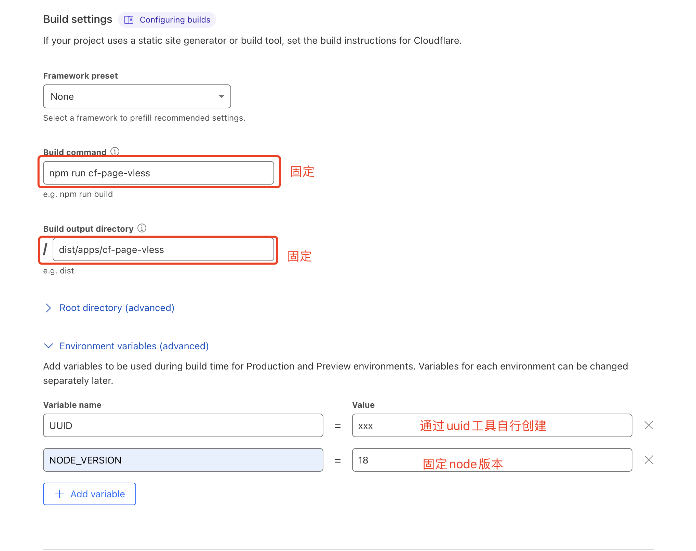
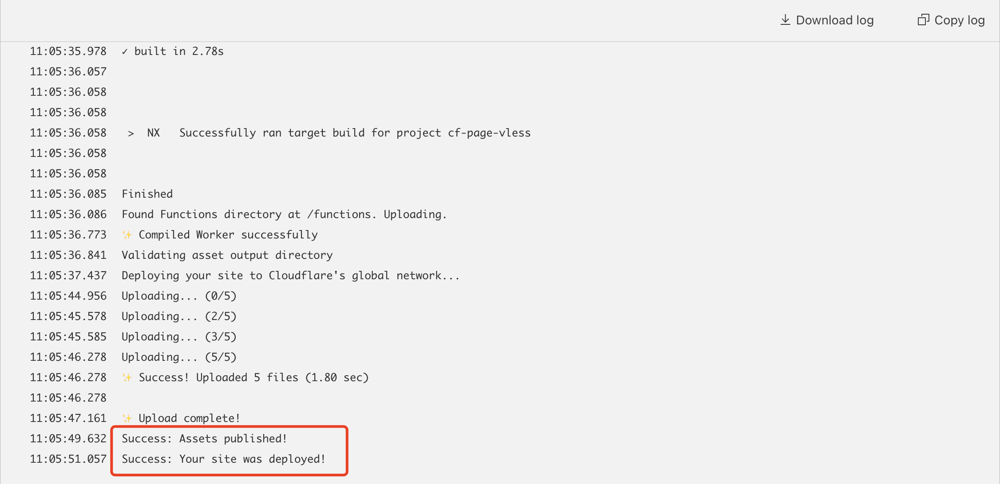
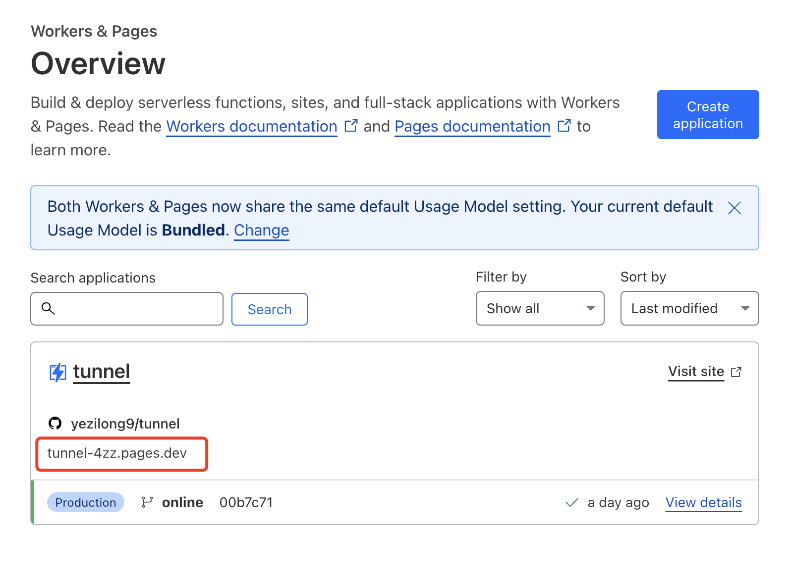
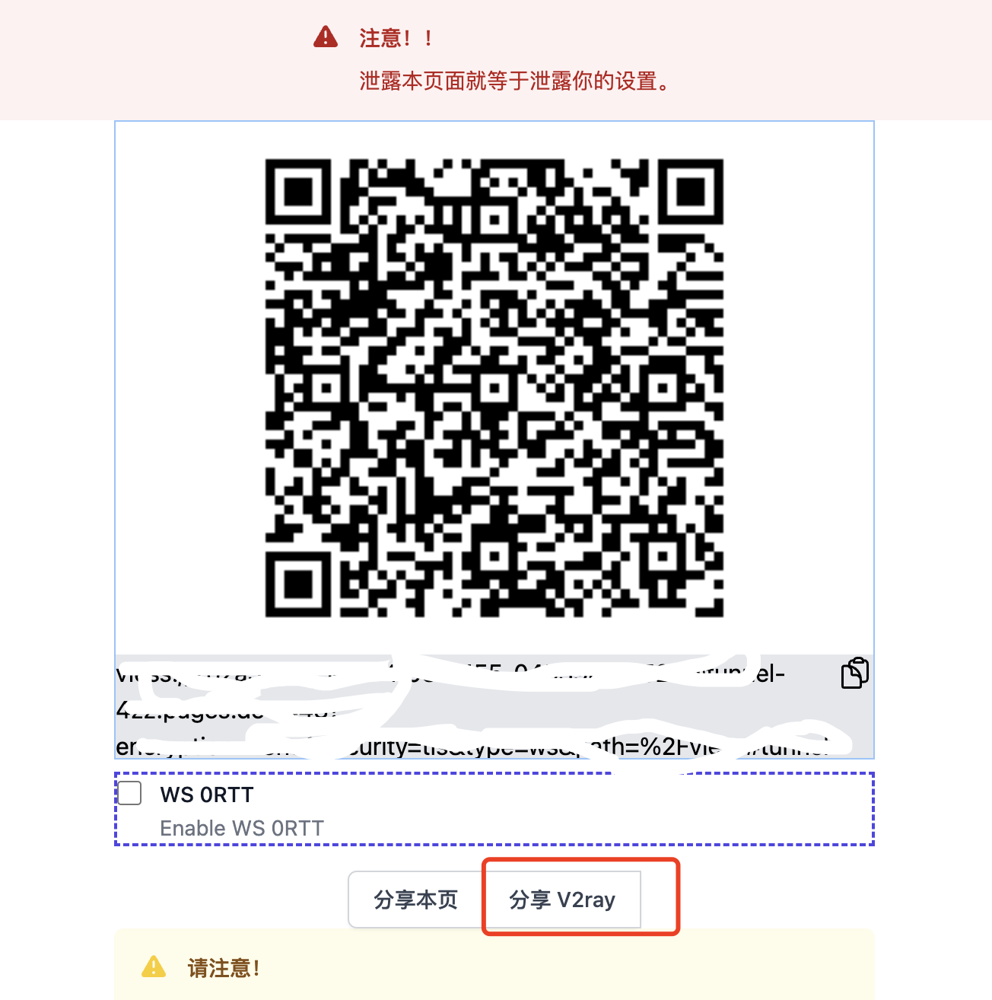

本教程主要用于学习如何搭建vless

## 注册cloudflare

> Cloudflare 是全球知名的CDN服务商，还有各种例如反代、内网穿透、ssl等功能，能够很好的帮助你的网站提升体验，个人免费的套餐就已经足够我们日常使用了
>
> 其中里面有worker和pages，pages可以帮助部署项目，比github pages更为强大，我们这次就是利用这个pages免费为我们搭建一个vless节点服务

前往[cloudflare](https://www.cloudflare-cn.com/plans/) 点击页面下方免费套餐

注册流程非常简单，这里不再作详细说明了，大家记得**验证邮箱**

## github导入项目

登录自己的github点击添加项目

名字自选，但是克隆的项目地址填写：https://github.com/yezilong9/tunnel.git

> 这是基于一个开源的项目 [edgetunnel](https://github.com/zizifn/edgetunnel)

点击begin import完成项目的导入

## 回到cloudflare部署

登录后台

1. 点击左边栏Workers & Pages
2. 切换到Pages的tab上
3. 点击中间Connect to Git

4. 点击后会进入新页面，这里选择我们刚刚建好的项目

5. 跳转页面后填入自己的项目名字（这里随便填，但是最好不要出现xray、vmess、vless、ss、trojan等等节点协议字眼），**Production branch** 选择**online**

6. 来到Build settings，参数固定如下图

   | 参数                       | 参数值                                              |
   | -------------------------- | --------------------------------------------------- |
   | **Build command**          | npm run cf-page-vless                               |
   | **Build output directory** | dist/apps/cf-page-vless                             |
   | UUID                       | 通过 [uuid工具](https://1024tools.com/uuid)生成即可 |
   | NODE_VERSION               | 18                                                  |

   

   这个UUID需要大家记录一下，因为是作为你连接的password用的

7. 最后点击Save and Deploy部署即可，需要等待3-5分钟左右，部署完成后会出现

   

8. 这时回到Pages页面，复制项目链接到浏览器，即可访问

   

9. 如果页面弹出用户名密码输入框，只需在用户名上填入生成的uuid就可以进入页面，点击分享V2ray生成vless节点连接

   

10. 保存好连接地址，打开你的手机，打开支持vless协议的VPN工具快乐地科学上网吧

说到这里部署流程已经完成了，免费的Cloudflare服务每个worker + pages 一共每天请求不能超过10万次，我感觉查查资料学习绝对是足够的，只要不是看视频

## 最后最后，奉劝大家科学上网之余千万别把账号、链接提供他人，或作盈利之用，这有可能触犯刑法，后果严重