本教程主要用于cludflare学习搭建，非盈利性质

## 注册cloudflare

> Cloudflare 是全球知名的CDN服务商，还有各种例如反代、内网穿透、ssl等功能，能够很好的帮助你的网站提升体验，个人免费的套餐就已经足够我们日常使用了
>
> 其中里面有worker和pages，pages可以帮助部署项目，比github pages更为强大，我们这次就是利用这个pages免费为我们搭建一个vless节点服务

前往[cloudflare](https://www.cloudflare-cn.com/plans/) 点击页面下方免费套餐

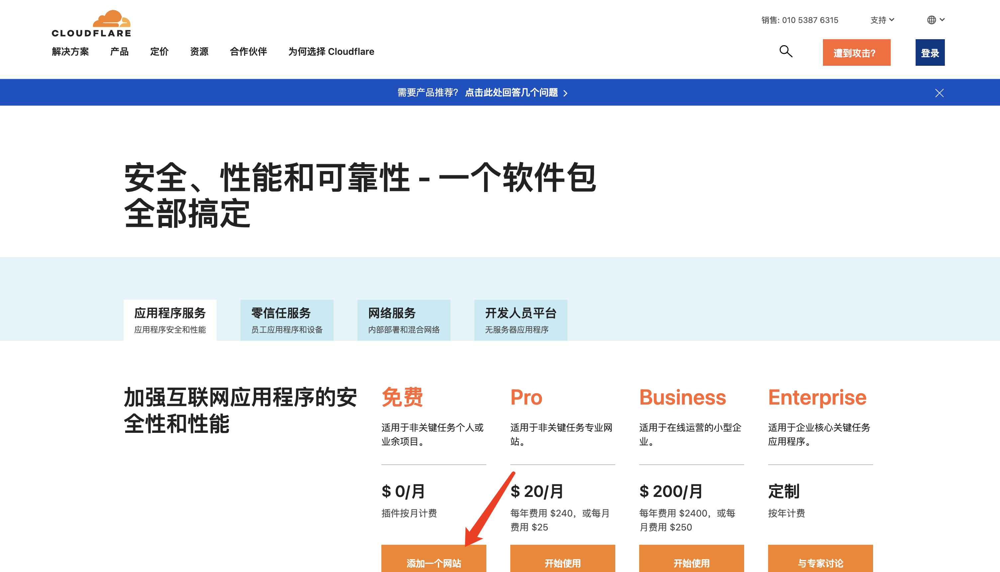

注册流程非常简单，这里不再作详细说明了，大家记得**验证邮箱**

### 创建 KV命名空间

1. 准备一个 Cloudflare 账号，点击 `储存和数据库` > `Workers KV` > 输入任意名称点击`创建`即可

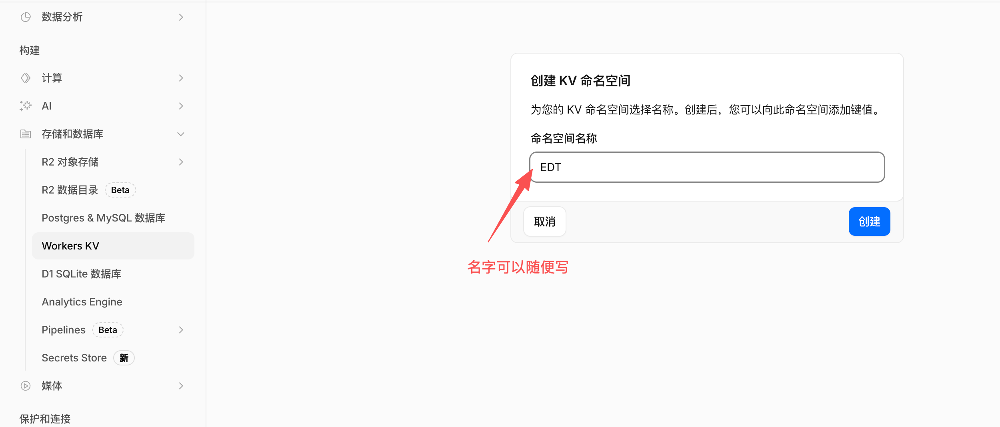

### 

### 创建 Pages 应用程序

1. 点击 [edgetunnel-main.zip](https://github.com/cmliu/edgetunnel/archive/refs/heads/main.zip) 下载最新版本项目压缩包备用；
2. 点击 `计算和AI` > `Workers 和 Pages` > `创建应用程序`；

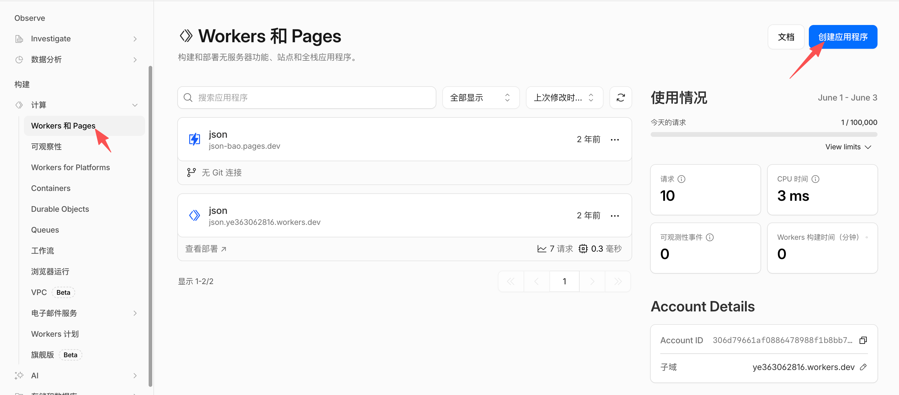

3. 点击`开始使用`

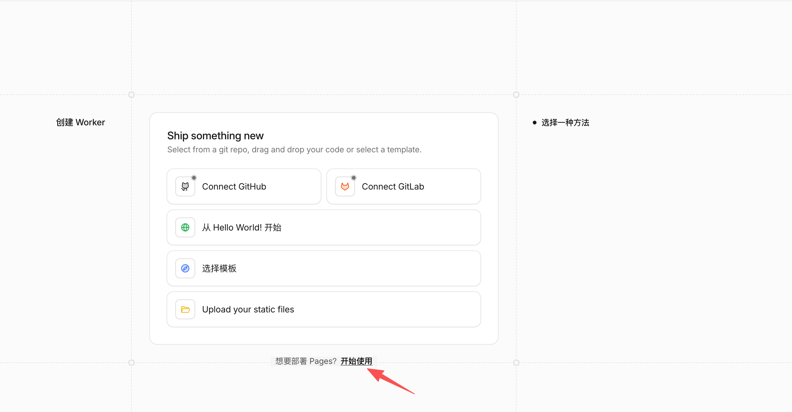

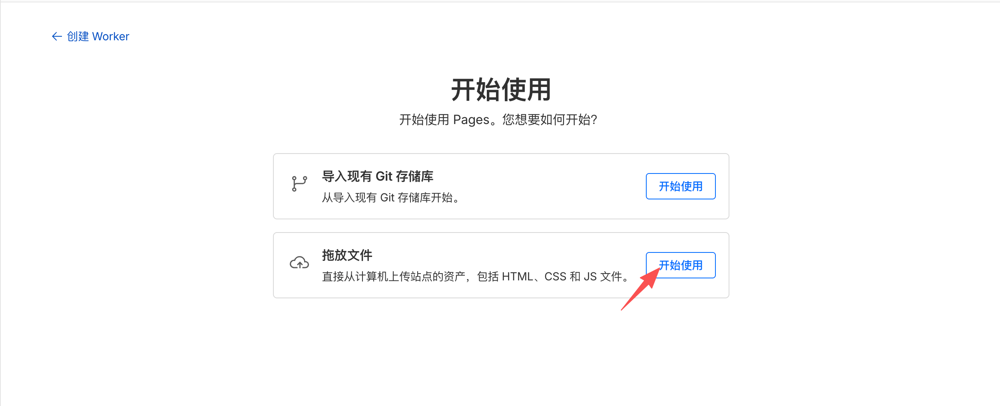

4. 填写项目名称后点击`创建项目`

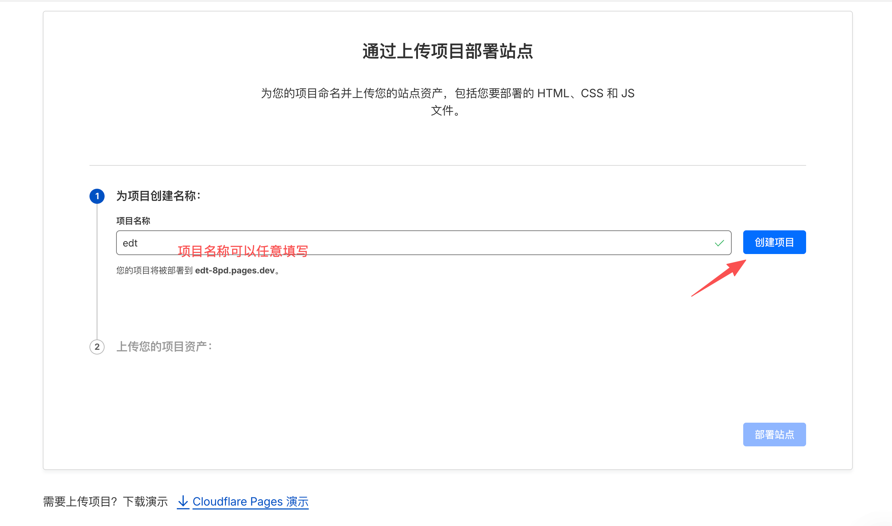

5. 点击`上传`刚刚下载的压缩包然后`部署站点`

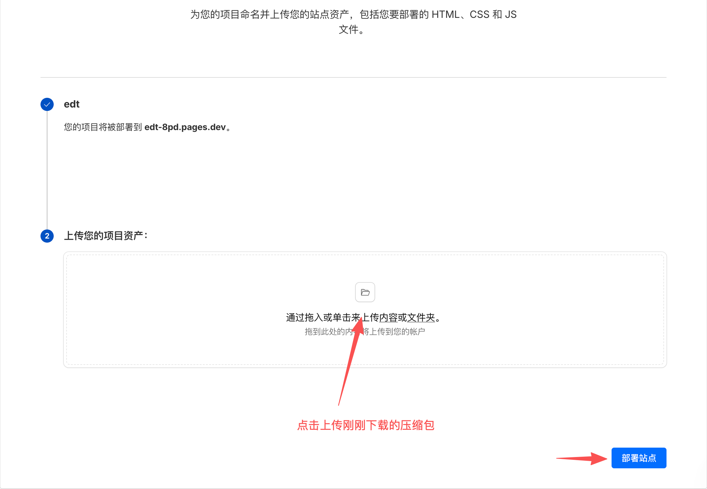

6. 部署成功会跳转页面，点击`继续处理项目`

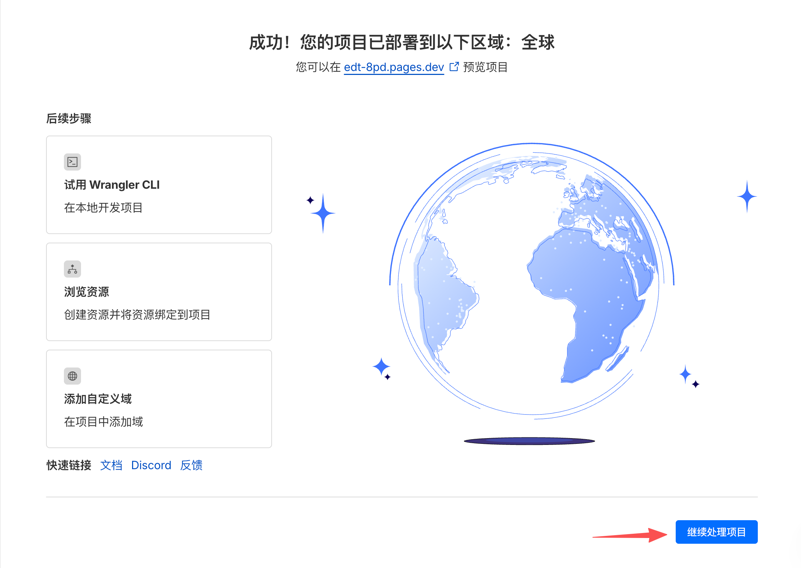

7. 选择`设置` > `变量和机密` 添加变量

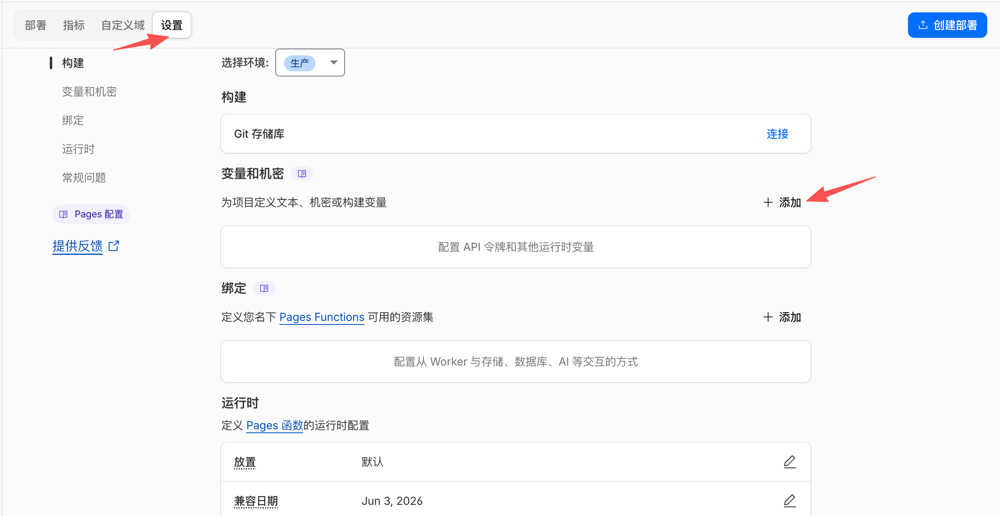

8. 输入ADMIN变量和值（后台管理员登录的密码）后，点击`保存`

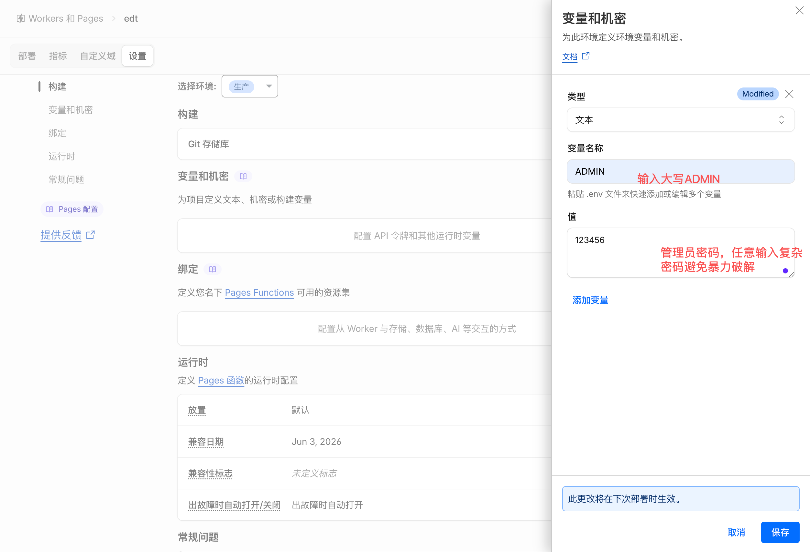

9. 绑定KV命名空间，选择刚刚创建的KV命名空间（变量名称需要大写“KV”）

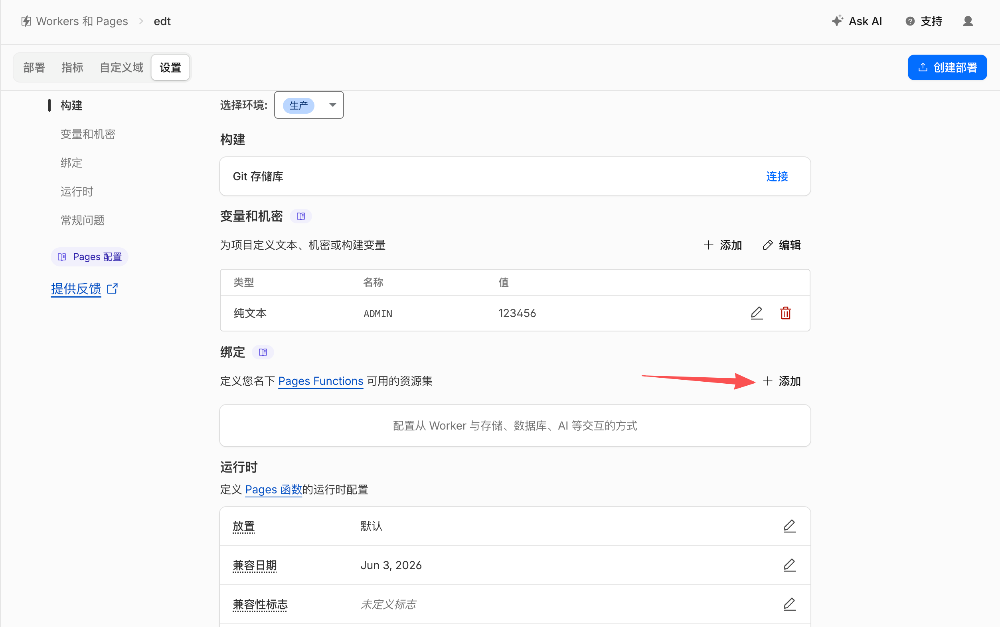

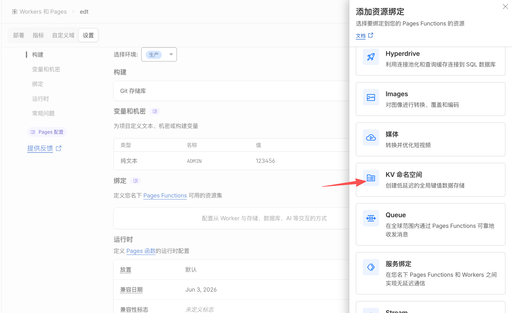

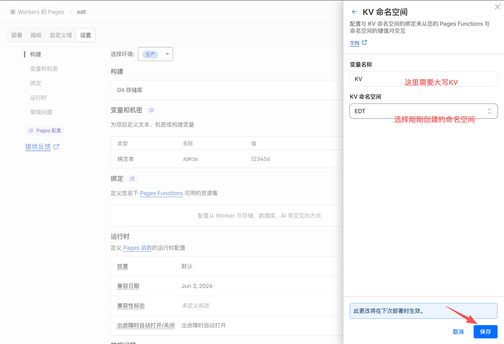

9. 保存后点击`创建部署`

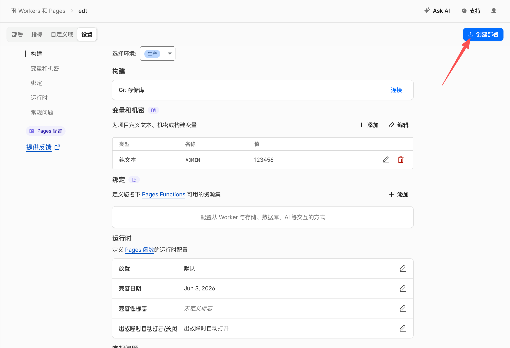

10. 进行二次部署，上传后点击`保存并部署`

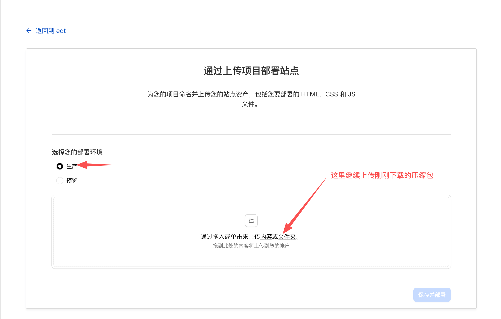

11. 看到这个页面就证明已经部署成功并有实际的生产链接

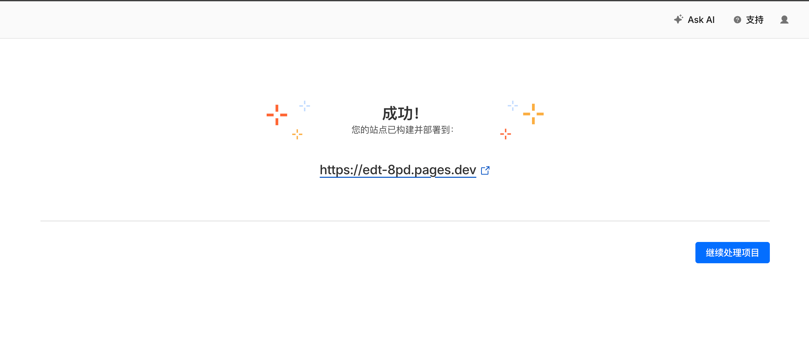

12. 在浏览器部署成功的地址，后面添加/login即可打开（如教程的地址：https://edt-8pd.pages.dev/login），然后输入你变量的密码进入

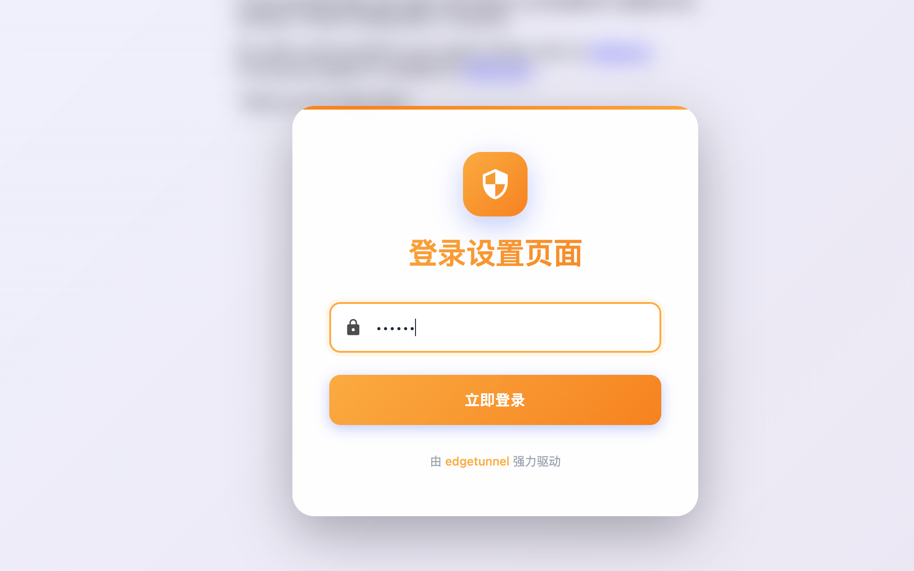

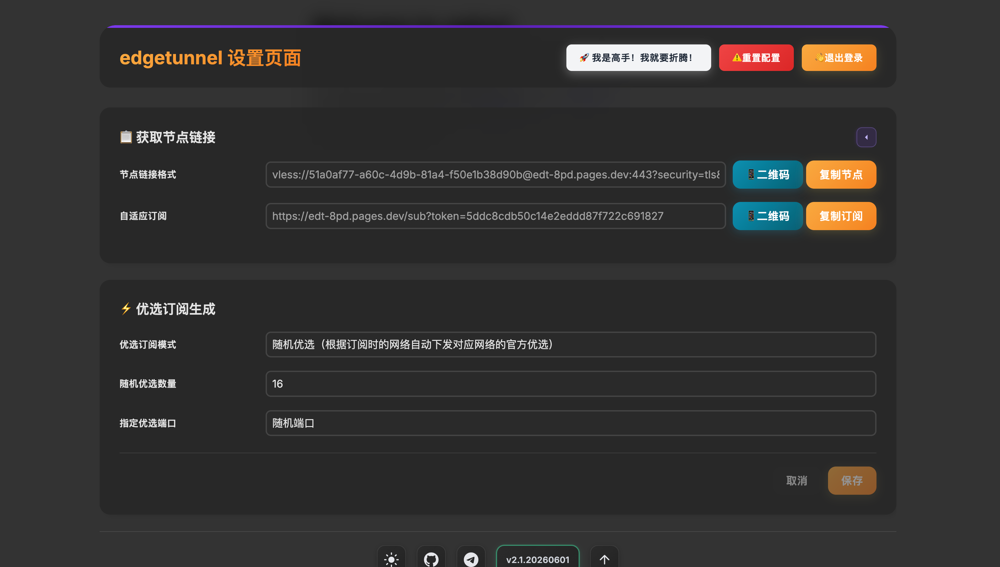

### 恭喜你已经成功部署你的专属通道，接下来如何订阅我就不详细说明了

## 最后最后，奉劝大家科学上网之余千万别把账号、链接提供他人，或作盈利之用，这有可能触犯刑法，后果严重
